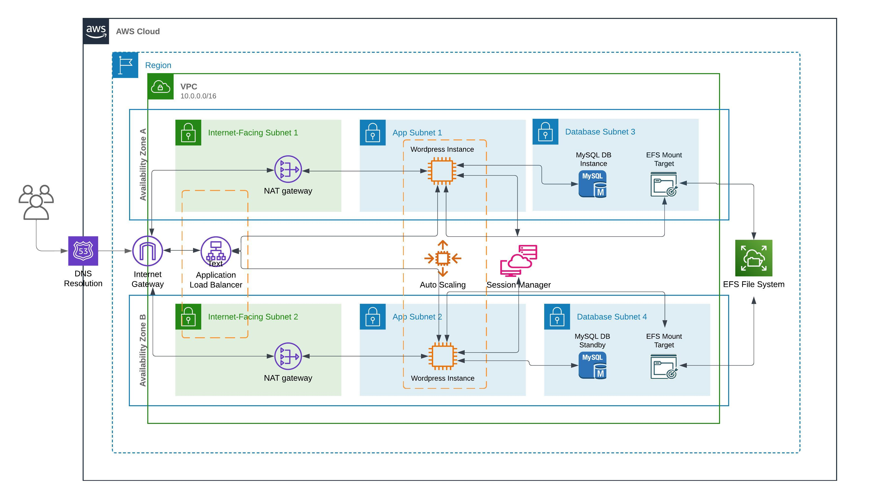

# Infrastruttura WordPress su AWS con Terraform

Questa repository contiene una configurazione Terraform per distribuire un ambiente WordPress su AWS. La configurazione è progettata per garantire un'architettura modulare che distribuisce i vari componenti dell'applicazione in un ambiente scalabile e resiliente.

## Diagramma dell'infrastruttura



## Descrizione del Progetto

Questo progetto ha l'obiettivo di creare un ambiente AWS scalabile per ospitare un'installazione di WordPress, utilizzando servizi cloud che permettono una facile gestione e manutenzione dell'infrastruttura. La configurazione è pensata per garantire un'architettura modulare per ambienti di sviluppo, assicurando che il setup sia rapido e facilmente replicabile, supportando più zone di disponibilità (AZ) per migliorare la resilienza.

L'infrastruttura sfrutta un load balancer (ALB) per distribuire il traffico HTTP alle istanze EC2 di WordPress, configurate in un gruppo di auto-scaling (ASG) per mantenere la scalabilità automatica. I dati persistenti di WordPress sono ospitati su Amazon RDS (MySQL) per la gestione dei dati strutturati e su Amazon EFS per i file condivisi.

## Prerequisiti

- **AWS Account**: Un account AWS configurato con le credenziali necessarie.
- **Terraform**
- **Credenziali AWS**: È possibile configurare le credenziali AWS usando il comando `aws configure` oppure tramite variabili d’ambiente:
  ```bash
  export AWS_ACCESS_KEY_ID="tuo_access_key_id"
  export AWS_SECRET_ACCESS_KEY="tuo_secret_access_key"
  export AWS_REGION="eu-central-1"
  ```
- **IAM Role**: Assicurarsi di avere un ruolo con i permessi necessari per creare le risorse AWS descritte.

## Configurazione e Avvio

1. **Clona il repository**:
   ```bash
   git clone <URL_REPOSITORY>
   cd <NOME_CARTELLA>
   ```

2. **Configura la versione di WordPress**:
   Normalmente viene installata l'ultima versione di Wordpress.
   Nel file `variables.tf`, si può specificare la versione di WordPress da installare modificando la variabile `wordpress_version`. 
   Se si desidera una versione diversa dall'ultima, si può specificare `wordpress-6.5`, ad esempio.

3. **Inizializza Terraform**:
   ```bash
   terraform init
   ```

4. **Esegui il piano di esecuzione**:
   Questo comando genera un piano di esecuzione e mostra le risorse che verranno create/modificate:
   ```bash
   terraform plan
   ```

5. **Applica il piano**:
   Lancio della creazione delle risorse:
   ```bash
   terraform apply
   ```
   Per confermare la creazione è necessario digitare "yes" quando richiesto, oppure usare il flag -auto-approve al lancio del comando.

6. **Output finale**:
   Al termine dell’esecuzione, Terraform mostrerà l’endpoint del load balancer, che si può usare per accedere all'installazione di WordPress.

## Descrizione della Soluzione

L’infrastruttura è composta da:

- **VPC** con subnet pubbliche e private per isolare i livelli dell’applicazione.
- **Application Load Balancer (ALB)** per gestire il traffico HTTP verso le istanze di WordPress.
- **Auto Scaling Group (ASG)** per mantenere il numero desiderato di istanze.
- **Amazon RDS (MySQL)** per il database, protetto tramite sicurezza a livello di VPC.
- **Amazon EFS** per storage condiviso, usato per ospitare i file di WordPress.
- **Amazon KMS** per la gestione delle chiavi di crittografia di RDS e EFS.
- **IAM Role** per permettere l’accesso a SSM, facilitando la gestione delle istanze EC2.

### Sicurezza

Poiché questa è un'infrastruttura per ambiente di sviluppo, non è stato implementato HTTPS tramite TLS. Non essendoci un dominio assegnato né un certificato SSL, l'ambiente è esposto su HTTP. Questa configurazione semplifica i test in ambiente di sviluppo, ma non è consigliata per produzione.

L'infrastruttura è configurata per minimizzare i punti di accesso e aumentare la sicurezza:

- **Security Group**: Ogni security group è configurato in modo tale da permettere solo gli accessi necessari. Ad esempio, solo il traffico HTTP (porta 80) è consentito per il load balancer e le istanze dell'applicazione. Il database e i servizi interni sono accessibili solo dai componenti autorizzati all'interno della VPC, garantendo che il traffico dall'esterno sia bloccato.

- **Accesso tramite AWS Systems Manager (SSM)**: Invece di esporre la porta 22 per l'accesso SSH, l'infrastruttura utilizza SSM per gestire in modo sicuro le connessioni alle istanze. Questo approccio aumenta la sicurezza e riduce la superficie d'attacco, poiché non ci sono porte SSH aperte verso Internet.

#### Accesso alle istanze

Per accedere alle istanze tramite SSM, è possibile usare la console AWS o il comando AWS CLI:

1. **Prerequisiti**:
   - Nel caso si volesse utilizzare la CLI, assicurarsi di avere il **Session Manager Plugin** installato. È possibile installarlo seguendo le [istruzioni ufficiali](https://docs.aws.amazon.com/systems-manager/latest/userguide/session-manager-working-with-install-plugin.html).
   
2. **Accesso tramite Console AWS**:
   - Accedere alla console di **AWS EC2**.
   - Selezionare l’istanza a cui si desidera accedere.
   - Nella sezione **Actions (Azioni)**, scegliere **Connect** e poi **Session Manager** per avviare la sessione.

3. **Accesso tramite AWS CLI**:
   - Utilizzare il seguente comando per connettersi all’istanza tramite SSM:
     ```bash
     aws ssm start-session --target <id_istanza>
     ```
   - Sostituire `<id_istanza>` con l'ID dell'istanza EC2 a cui si vuole accedere.

Utilizzando SSM, tutte le connessioni sono crittografate e monitorate tramite CloudWatch Logs (se abilitato), fornendo un controllo maggiore sulle attività di accesso rispetto all'uso di SSH diretto.

## Migliorie Future

1. **Implementazione di HTTPS**: Aggiungere un certificato SSL per il bilanciatore di carico (ALB) e configurare HTTPS.

2. **Logging e Monitoraggio**: Integrazione con Amazon CloudWatch per il monitoraggio dettagliato delle risorse e CloudTrail per il logging.

3. **Scalabilità Avanzata**: Configurare policy di Auto Scaling basate su metriche come CPU o latenza per ottimizzare i costi.

4. **Caching tramite Memcached**: Integrare un sistema di caching come **Amazon ElastiCache (Memcached)** per ridurre il carico sul database, migliorando le performance per le operazioni di lettura.

5. **Database Amazon Aurora**: Migrare a **Amazon Aurora** come soluzione di database, che offre compatibilità con MySQL e migliori prestazioni, oltre a una maggiore scalabilità rispetto a RDS MySQL.

6. **Amazon WAF (Web Application Firewall)**: Implementare un WAF per proteggere l'applicazione da attacchi comuni (ad esempio SQL injection, XSS).

## Ottimizzazione delle Performance

Per ottimizzare ulteriormente l'infrastruttura:

- **Abilitare il caching a livello di applicazione**: Configurare WordPress per sfruttare il caching delle pagine e degli oggetti, riducendo la latenza per gli utenti.
- **Configurare Amazon CloudFront**: Utilizzare un CDN come Amazon CloudFront abbinato a S3 per distribuire i contenuti statici globalmente, migliorando le performance e riducendo la latenza per gli utenti.
- **Abilitare la replica del database**: Per garantire un elevato livello di disponibilità e migliorare le prestazioni in scenari di lettura intensiva, attivare la replica su Amazon Aurora o su RDS MySQL.

## Note

Questa soluzione è un esempio per ambiente di sviluppo e non è consigliata per ambienti di produzione senza le opportune modifiche a livello di sicurezza e scalabilità.

# Ulteriori dettagli tecnici lato codice

## Requirements

| Name | Version |
|------|---------|
| <a name="requirement_terraform"></a> [terraform](#requirement\_terraform) | >= 1.00 |
| <a name="requirement_aws"></a> [aws](#requirement\_aws) | >=5.0 |

## Providers

| Name | Version |
|------|---------|
| <a name="provider_aws"></a> [aws](#provider\_aws) | 5.74.0 |

## Modules

| Name | Source | Version |
|------|--------|---------|
| <a name="module_subnets_cidrs"></a> [subnets\_cidrs](#module\_subnets\_cidrs) | hashicorp/subnets/cidr | 1.0.0 |
| <a name="module_vpc"></a> [vpc](#module\_vpc) | terraform-aws-modules/vpc/aws | 5.14.0 |

## Resources

| Name | Type |
|------|------|
| [aws_autoscaling_group.wordpress_asg](https://registry.terraform.io/providers/hashicorp/aws/latest/docs/resources/autoscaling_group) | resource |
| [aws_db_instance.wordpress_db](https://registry.terraform.io/providers/hashicorp/aws/latest/docs/resources/db_instance) | resource |
| [aws_efs_file_system.wordpress_efs](https://registry.terraform.io/providers/hashicorp/aws/latest/docs/resources/efs_file_system) | resource |
| [aws_efs_mount_target.wordpress_efs_az_target](https://registry.terraform.io/providers/hashicorp/aws/latest/docs/resources/efs_mount_target) | resource |
| [aws_eip.nat](https://registry.terraform.io/providers/hashicorp/aws/latest/docs/resources/eip) | resource |
| [aws_iam_instance_profile.SSM_EC2_instance_profile](https://registry.terraform.io/providers/hashicorp/aws/latest/docs/resources/iam_instance_profile) | resource |
| [aws_iam_policy_attachment.SSM_EC2_policy_attachment](https://registry.terraform.io/providers/hashicorp/aws/latest/docs/resources/iam_policy_attachment) | resource |
| [aws_iam_role.SSM_for_EC2](https://registry.terraform.io/providers/hashicorp/aws/latest/docs/resources/iam_role) | resource |
| [aws_kms_alias.efs_kms_alias](https://registry.terraform.io/providers/hashicorp/aws/latest/docs/resources/kms_alias) | resource |
| [aws_kms_alias.rds_kms_alias](https://registry.terraform.io/providers/hashicorp/aws/latest/docs/resources/kms_alias) | resource |
| [aws_kms_key.efs_kms_key](https://registry.terraform.io/providers/hashicorp/aws/latest/docs/resources/kms_key) | resource |
| [aws_kms_key.rds_kms_key](https://registry.terraform.io/providers/hashicorp/aws/latest/docs/resources/kms_key) | resource |
| [aws_launch_template.wordpress_lt](https://registry.terraform.io/providers/hashicorp/aws/latest/docs/resources/launch_template) | resource |
| [aws_lb.wordpress_alb](https://registry.terraform.io/providers/hashicorp/aws/latest/docs/resources/lb) | resource |
| [aws_lb_listener.wordpress_listener](https://registry.terraform.io/providers/hashicorp/aws/latest/docs/resources/lb_listener) | resource |
| [aws_lb_target_group.wordpress_tg](https://registry.terraform.io/providers/hashicorp/aws/latest/docs/resources/lb_target_group) | resource |
| [aws_secretsmanager_secret.wordpress_db](https://registry.terraform.io/providers/hashicorp/aws/latest/docs/resources/secretsmanager_secret) | resource |
| [aws_secretsmanager_secret_version.wordpress_db](https://registry.terraform.io/providers/hashicorp/aws/latest/docs/resources/secretsmanager_secret_version) | resource |
| [aws_security_group.app_sg](https://registry.terraform.io/providers/hashicorp/aws/latest/docs/resources/security_group) | resource |
| [aws_security_group.db_sg](https://registry.terraform.io/providers/hashicorp/aws/latest/docs/resources/security_group) | resource |
| [aws_security_group.web_sg](https://registry.terraform.io/providers/hashicorp/aws/latest/docs/resources/security_group) | resource |
| [aws_availability_zones.available](https://registry.terraform.io/providers/hashicorp/aws/latest/docs/data-sources/availability_zones) | data source |
| [aws_caller_identity.current](https://registry.terraform.io/providers/hashicorp/aws/latest/docs/data-sources/caller_identity) | data source |
| [aws_region.current](https://registry.terraform.io/providers/hashicorp/aws/latest/docs/data-sources/region) | data source |
| [aws_secretsmanager_random_password.wordpress_db](https://registry.terraform.io/providers/hashicorp/aws/latest/docs/data-sources/secretsmanager_random_password) | data source |

## Inputs

| Name | Description | Type | Default | Required |
|------|-------------|------|---------|:--------:|
| <a name="input_db_instance_type"></a> [db\_instance\_type](#input\_db\_instance\_type) | DB instance type | `string` | `"db.c6gd.medium"` | no |
| <a name="input_db_username"></a> [db\_username](#input\_db\_username) | Database username | `string` | `"admin"` | no |
| <a name="input_instance_type"></a> [instance\_type](#input\_instance\_type) | EC2 instance type for launch template | `string` | `"m5.large"` | no |
| <a name="input_number_of_azs"></a> [number\_of\_azs](#input\_number\_of\_azs) | Number of AZs to be used | `number` | `1` | no |
| <a name="input_region"></a> [region](#input\_region) | AWS region for deployment | `string` | `"eu-central-1"` | no |
| <a name="input_vpc_cidr"></a> [vpc\_cidr](#input\_vpc\_cidr) | CIDR block for the VPC | `string` | `"10.0.0.0/16"` | no |
| <a name="input_wordpress_version"></a> [wordpress\_version](#input\_wordpress\_version) | Version of WordPress to install | `string` | `"latest"` | no |

## Outputs

| Name | Description |
|------|-------------|
| <a name="output_lb_endpoint"></a> [lb\_endpoint](#output\_lb\_endpoint) | n/a |
